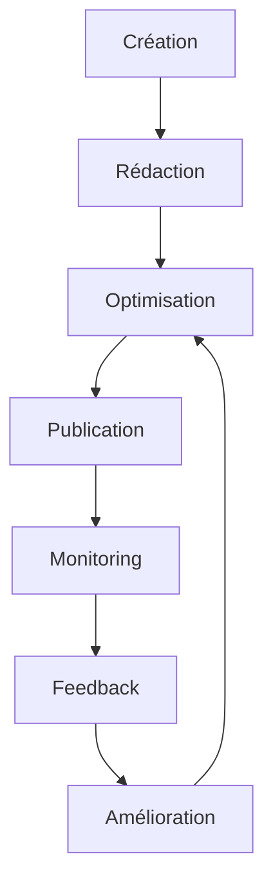

# 📚 Guide Complet des Ebooks StratCyber

## 🎯 Vue d'ensemble

Ce guide vous explique comment créer, modifier et gérer les ebooks interactifs dans StratCyber. Les ebooks sont des formations visuelles avec slides animées, images contextuelles et navigation interactive.

---

## 🚀 Créer un nouvel ebook

### 📋 Étape 1 : Accéder à la création

1. **Connectez-vous** en tant qu'admin
2. Allez sur **`/training`**
3. Cliquez sur **"Ajouter un ebook"**
4. Ou accédez directement à **`/training/create`**

### ✏️ Étape 2 : Remplir les informations de base

```yaml
Titre: "Sécurité des Mots de Passe"
Description: "Guide complet pour créer et gérer des mots de passe sécurisés"
Catégorie: "Sécurité"
Difficulté: "Débutant" | "Intermédiaire" | "Avancé"
Durée: "2h 30min"
Auteur: "Votre nom"
Tags: ["mots-de-passe", "authentification", "sécurité"]
```

### 📝 Étape 3 : Rédiger le contenu Markdown

Le contenu doit être structuré avec des titres qui deviendront automatiquement des slides :

```markdown
# Introduction aux mots de passe

## Qu'est-ce qu'un mot de passe sécurisé ?

Un mot de passe sécurisé doit respecter plusieurs critères essentiels :

- **Longueur minimale** : Au moins 12 caractères
- **Complexité** : Mélange de majuscules, minuscules, chiffres et symboles
- **Unicité** : Différent pour chaque compte
- **Imprévisibilité** : Éviter les mots du dictionnaire

## Les 7 règles d'or des mots de passe

1. **Utilisez des phrases de passe**
   Exemple : "MonChat@Mange3Souris!"

2. **Activez l'authentification à deux facteurs**
   Protection supplémentaire même si le mot de passe est compromis

3. **Utilisez un gestionnaire de mots de passe**
   Tools comme Bitwarden, 1Password ou Keepass

4. **Changez immédiatement les mots de passe par défaut**
   Ne jamais conserver "admin", "password123", etc.

5. **Évitez les informations personnelles**
   Pas de date de naissance, nom, adresse

6. **Utilisez des mots de passe uniques**
   Jamais le même mot de passe pour plusieurs comptes

7. **Vérifiez régulièrement vos comptes**
   Surveillez les connexions suspectes

## Types d'attaques contre les mots de passe

### Attaque par force brute
L'attaquant teste systématiquement toutes les combinaisons possibles.

### Attaque par dictionnaire  
Utilisation de listes de mots de passe courants.

### Ingénierie sociale
Manipulation psychologique pour obtenir des informations.

## Mise en pratique

✅ **À faire maintenant :**
- Auditez vos mots de passe actuels
- Installez un gestionnaire de mots de passe
- Activez la 2FA sur vos comptes critiques
- Créez des mots de passe uniques et forts

❌ **À éviter absolument :**
- Réutiliser le même mot de passe
- Utiliser des informations personnelles
- Partager vos mots de passe
- Les noter en clair

## Conclusion

La sécurité des mots de passe est la première ligne de défense. En appliquant ces bonnes pratiques, vous réduisez considérablement les risques de compromission.
```

### 🎨 Étape 4 : Optimisation du contenu pour les slides

#### ✅ **Bonnes pratiques de rédaction :**

1. **Titres clairs** : Chaque `##` devient une slide
2. **Listes structurées** : Utilisez `-`, `*` ou `1.` pour les points
3. **Émojis visuels** : ✅, ❌, ⚠️, 🎯, 💡 pour plus d'impact
4. **Contenu digestible** : Maximum 6-8 points par section
5. **Exemples concrets** : Illustrations pratiques
6. **Call-to-action** : Actions à réaliser

#### 📐 **Structure recommandée :**

```markdown
## Titre de la slide (court et accrocheur)

Introduction claire en 1-2 phrases.

### Points clés (auto-détectés pour l'affichage visuel) :
1. **Premier point important**
   Description concise et actionnable
   
2. **Deuxième point essentiel**
   Explication pratique avec exemple

3. **Troisième élément crucial**
   Conseil ou warning important

**💡 Conseil pro :** Ajoutez toujours un conseil pratique à la fin
```

### 🎨 Étape 5 : Images automatiques

Le système sélectionne automatiquement des images selon les mots-clés du titre :

- **"sécurité"** → Image de cadenas/cybersécurité
- **"données"** → Serveurs/bases de données  
- **"incident"** → Alertes/urgence
- **"conformité", "rgpd"** → Documents/compliance
- **"plan", "action"** → Stratégie/planning
- **"équipe"** → Collaboration/teamwork
- **"processus"** → Workflows/méthodes
- **"risque"** → Analyses/évaluations

💡 **Astuce :** Incluez ces mots-clés dans vos titres pour de meilleures images !

### 💾 Étape 6 : Publier l'ebook

1. **Prévisualisez** le contenu
2. Cochez **"Publié"** pour le rendre visible
3. Cliquez **"Créer l'ebook"**

---

## 🔄 Modifier un ebook existant

### 📍 Accéder à la modification

#### Méthode 1 : Interface utilisateur
1. Allez sur `/training`
2. Trouvez votre ebook dans la liste
3. Cliquez sur **"Modifier"** (icône crayon)

#### Méthode 2 : URL directe
Accédez à `/training/edit/[ID_EBOOK]`

#### Méthode 3 : Base de données (admin avancé)
```sql
-- Trouver un ebook par titre
SELECT id, title FROM ebooks WHERE title LIKE '%RGPD%';

-- Voir le contenu complet  
SELECT content FROM ebooks WHERE id = 'your-ebook-id';
```

### ✏️ Modifications possibles

#### **Métadonnées :**
- Titre, description, catégorie
- Difficulté, durée, auteur
- Tags et mots-clés
- Statut de publication

#### **Contenu Markdown :**
- Ajout/suppression de sections
- Modification du texte existant
- Restructuration des points clés
- Mise à jour des exemples

#### **Optimisations visuelles :**

**🔧 Pour améliorer une slide :**

```markdown
# AVANT (problématique)
## Sécurité des données

Les données doivent être protégées selon plusieurs principes fondamentaux de la cybersécurité moderne qui incluent la confidentialité, l'intégrité et la disponibilité avec des mesures techniques et organisationnelles appropriées.

# APRÈS (optimisé)
## Les 3 piliers de la sécurité des données

🔒 **Confidentialité :**
• Seules les personnes autorisées accèdent aux données
• Chiffrement des données sensibles
• Contrôle d'accès strict

🛡️ **Intégrité :**  
• Les données ne sont pas altérées
• Systèmes de vérification et checksums
• Sauvegarde et versioning

⚡ **Disponibilité :**
• Accès aux données quand nécessaire  
• Redondance et haute disponibilité
• Plans de continuité d'activité
```

### 🎯 Conseils d'optimisation spécifiques

#### **Pour les slides trop chargées :**
1. **Divisez en plusieurs slides** :
   ```markdown
   ## Les 7 principes RGPD
   # Devient →
   ## Les 7 principes RGPD (1/2)
   ## Les 7 principes RGPD (2/2)
   ```

2. **Utilisez des listes courtes** (max 6 points)
3. **Ajoutez des émojis** pour la lisibilité visuelle

#### **Pour corriger les tableaux markdown :**
```markdown
# AVANT (dégueulasse)
| Directive | Description | Date |
|-----------|-------------|------|
| NIS2 | Sécurité des réseaux | 2023 |
| RGPD | Protection des données | 2018 |

# APRÈS (optimisé)
## Principales directives européennes

🔐 **NIS2 - Sécurité des réseaux**
• Entrée en vigueur : 2023
• Cible : Infrastructures critiques
• Impact : Obligations de cybersécurité renforcées

🛡️ **RGPD - Protection des données**  
• Entrée en vigueur : 2018
• Cible : Toutes les organisations
• Impact : Consentement et droits des personnes
```

#### **Pour améliorer la navigation :**
1. **Titres descriptifs** : "Configuration des pare-feu" vs "Configuration"  
2. **Progression logique** : Intro → Concepts → Pratique → Conclusion
3. **Transitions fluides** entre les slides

---

## 🗄️ Structure de la base de données

### 📊 Schéma de l'ebook

```sql
Table: ebooks
- id (UUID, Primary Key)
- title (String)
- description (Text, nullable)
- content (JSON) -- Contient le markdown et métadonnées
- author (String)
- category (String)
- difficulty (Enum: Débutant/Intermédiaire/Avancé)
- duration (String, nullable)
- pages (Integer, nullable)
- rating (Decimal, default: 4.5)
- downloads (Integer, default: 0)
- tags (JSON Array)
- thumbnailUrl (String, nullable)
- isPublished (Boolean, default: false)
- createdAt (DateTime)
- updatedAt (DateTime)
```

### 🔄 Format du contenu JSON

```json
{
  "markdown": "# Contenu complet en markdown...",
  "metadata": {
    "generatedFrom": "manual",
    "generatedAt": "2024-01-15T10:30:00Z",
    "userSpecific": false,
    "estimatedReadingTime": "2h 30min",
    "slideCount": 15
  },
  "chapters": [
    {
      "title": "Introduction",
      "content": "...",
      "practicalExamples": ["Exemple 1", "Exemple 2"],
      "actionItems": ["Action 1", "Action 2"]
    }
  ]
}
```

---

## 🔧 Système de rendu des slides

### 🎨 Types de slides auto-détectés

Le système analyse automatiquement le contenu et choisit le meilleur rendu :

#### **1. Slide Titre** (`type: 'title'`)
- **Trigger** : Premier slide de l'ebook
- **Contenu** : Métadonnées + icône animée
- **Style** : Hero section avec gradient

#### **2. Slide Liste** (`type: 'list'`)  
- **Trigger** : 3+ éléments numérotés OU à puces OU avec émojis
- **Exemples** :
  ```markdown
  1. Premier point
  2. Deuxième point  
  3. Troisième point
  
  ✅ Point validé
  ❌ Point à éviter
  ⚠️ Point d'attention
  ```
- **Rendu** : Grid adaptatif (1-2 colonnes selon le nombre)

#### **3. Slide Highlight** (`type: 'highlight'`)
- **Trigger** : Contenu court (< 200 caractères)
- **Usage** : Messages clés, citations, définitions
- **Style** : Centré avec icône ampoule

#### **4. Slide Contenu** (`type: 'content'`)
- **Trigger** : Contenu standard
- **Layout** : Image + texte (si image disponible)
- **Extraction** : Points clés automatiques si détectés

#### **5. Slide Conclusion** (`type: 'conclusion'`)
- **Trigger** : Dernier slide automatique
- **Contenu** : Call-to-action + étapes suivantes
- **Style** : Trophée + boutons d'action

### 🎭 Algorithme de détection amélioré

```javascript
// Priorité de détection (dans l'ordre) :
1. Listes numérotées (≥3) → 'list'
2. Listes à puces (≥3) → 'list'  
3. Listes émojis (≥2) → 'list'
4. Tableaux markdown → 'list' (convertis automatiquement)
5. Blocs de code → 'content' (plus de card noire)
6. Contenu court (<200 car.) → 'highlight'
7. Défaut → 'content'
```

### 🖼️ Système d'images automatique

```javascript
// Association titre → image Unsplash haute qualité
const imageMapping = {
  "introduction|objectifs": "https://images.unsplash.com/photo-1522071820081-009f0129c71c?ixlib=rb-4.0.3&w=800",
  "sécurité": "https://images.unsplash.com/photo-1563013544-824ae1b704d3?ixlib=rb-4.0.3&w=800", 
  "données": "https://images.unsplash.com/photo-1558494949-ef010cbdcc31?ixlib=rb-4.0.3&w=800",
  "incident": "https://images.unsplash.com/photo-1504868584819-f8e8b4b6d7e3?ixlib=rb-4.0.3&w=800",
  "conformité|rgpd|nis2": "https://images.unsplash.com/photo-1450101499163-c8848c66ca85?ixlib=rb-4.0.3&w=800",
  "plan|action": "https://images.unsplash.com/photo-1611224923853-80b023f02d71?ixlib=rb-4.0.3&w=800",
  "équipe|organisation": "https://images.unsplash.com/photo-1600880292203-757bb62b4baf?ixlib=rb-4.0.3&w=800",
  "processus": "https://images.unsplash.com/photo-1460925895917-afdab827c52f?ixlib=rb-4.0.3&w=800",
  "risque|analyse": "https://images.unsplash.com/photo-1551434678-e076c223a692?ixlib=rb-4.0.3&w=800"
};
```

---

## 🛠️ API et intégrations

### 📡 Endpoints disponibles

#### **Lister les ebooks**
```http
GET /api/training/ebook
Response: Array<Ebook>
```

#### **Récupérer un ebook**
```http
GET /api/training/ebook/[id]
Response: Ebook avec contenu complet
```

#### **Créer un ebook**
```http
POST /api/training/ebook
Body: EbookCreateData
Response: Ebook créé
```

#### **Modifier un ebook**
```http
PUT /api/training/ebook/[id] 
Body: EbookUpdateData
Response: Ebook modifié
```

#### **Supprimer un ebook**
```http
DELETE /api/training/ebook/[id]
Response: Status de suppression
```

### 🔄 Synchronisation

#### **Commande de sync :**
```bash
npm run ebooks:sync
```

Cette commande :
1. Recharge tous les ebooks depuis la BDD
2. Reparse le contenu JSON/Markdown  
3. Met à jour les slides et métadonnées
4. Optimise les images et références
5. Corrige les problèmes de formatage automatiquement

---

## 🎯 Bonnes pratiques

### ✅ **Recommandations générales**

#### **Structure du contenu :**
1. **Introduction claire** : Contexte et objectifs
2. **Développement logique** : Concepts → Pratique  
3. **Exemples concrets** : Cas d'usage réels
4. **Récapitulatif** : Points clés à retenir

#### **Rédaction optimisée :**
- **Phrases courtes** (< 20 mots)
- **Vocabulaire accessible** (éviter le jargon excessif)
- **Structure parallèle** dans les listes
- **Appels à l'action** clairs et réalisables

#### **Visuels et formatage :**
- **Émojis pertinents** : 🔒 🛡️ ⚠️ ✅ ❌ 🎯 💡
- **Mise en gras** pour les termes importants
- **Listes numérotées** pour les étapes
- **Listes à puces** pour les caractéristiques

### ❌ **À éviter absolument**

1. **Slides surchargées** (> 8 points par slide)
2. **Titres génériques** ("Sécurité" vs "Sécurisation des mots de passe")  
3. **Contenu brut** sans structuration
4. **Tableaux complexes** (utiliser des listes)
5. **Blocs de code longs** (fragmenter)
6. **Jargon non expliqué**

### 🎨 **Optimisation visuelle avancée**

#### **Pour les slides de liste (ex: "7 principes RGPD") :**
```markdown
## Les 7 règles d'or du RGPD 📋

1. **Transparence totale** 🔍
   • Expliquez pourquoi vous collectez des données
   • Informez en langage simple et accessible
   • Documentez vos traitements

2. **Bases légales solides** ⚖️
   • Consentement explicite et libre
   • Contrat nécessitant les données
   • Intérêt légitime justifié

3. **Minimisation des données** 🎯  
   • Collectez uniquement le nécessaire
   • Limitez la durée de conservation
   • Supprimez les données obsolètes

4. **Sécurité renforcée** 🔐
   • Chiffrement des données sensibles
   • Contrôles d'accès stricts  
   • Sauvegarde et plans de continuité

5. **Droits des personnes** 👥
   • Droit d'accès aux données
   • Rectification et suppression
   • Portabilité des données

6. **Accountability** 📝
   • Documentation des mesures
   • Registre des traitements
   • Analyses d'impact (AIPD)

7. **Gouvernance continue** 🔄
   • DPO désigné si nécessaire
   • Formation des équipes
   • Audits réguliers
```

#### **Pour les slides de contenu avec tableaux :**
```markdown
## Articulation RGPD et NIS2 🤝

Ces deux réglementations européennes se complètent pour une cybersécurité globale :

🛡️ **NIS2 - L'approche sécurité**
• **Scope** : Secteurs critiques (énergie, transport, santé...)
• **Focus** : Protection des infrastructures
• **Obligations** : Mesures techniques et organisationnelles
• **Sanctions** : Jusqu'à 10M€ ou 2% CA mondial

🔒 **RGPD - L'approche données**  
• **Scope** : Toutes les organisations traitant des données UE
• **Focus** : Protection des données personnelles
• **Obligations** : Consentement, droits, privacy by design
• **Sanctions** : Jusqu'à 20M€ ou 4% CA mondial

💡 **Synergies pratiques :**
• Chiffrement → Protection données (RGPD) + Résilience systèmes (NIS2)
• Authentification forte → Accès sécurisé + Contrôle des traitements
• Incident response → Notification RGPD (72h) + Signalement NIS2
• Risk assessment → AIPD pour données + Analyse cyber-risques
```

---

## 🔍 Dépannage courant

### ⚠️ **Problèmes fréquents et solutions**

#### **1. Slide "7 principes" mal formatée**
**Symptôme :** Contenu qui déborde, pas de grid 2 colonnes
**Solution :** 
```markdown
# ❌ Mauvais format
## Les 7 principes RGPD
1. Premier principe avec beaucoup de texte qui déborde...
2. Deuxième principe très long aussi...

# ✅ Bon format  
## Les 7 règles d'or du RGPD

1. **Transparence** - Informez clairement
2. **Bases légales** - Justifiez la collecte  
3. **Minimisation** - Limitez au nécessaire
4. **Sécurité** - Protégez les données
5. **Droits** - Respectez les personnes
6. **Documentation** - Tracez vos actions
7. **Gouvernance** - Organisez-vous
```

#### **2. Tableaux markdown dégueulasses** 
**Symptôme :** Rendu cassé avec pipes et tirets
**Solution :** Le système convertit automatiquement, mais vous pouvez optimiser :
```markdown
# ❌ Tableau markdown (converti auto mais moche)
| Aspect | RGPD | NIS2 |
|--------|------|------|
| Scope | Données | Infra |

# ✅ Liste structurée (rendu parfait)
## Comparaison RGPD vs NIS2

🎯 **Champ d'application**
• RGPD : Données personnelles dans l'UE
• NIS2 : Infrastructures critiques et numériques

⚖️ **Sanctions maximales** 
• RGPD : 20M€ ou 4% du CA mondial
• NIS2 : 10M€ ou 2% du CA mondial
```

#### **3. Cards noires de code markdown**
**Symptôme :** Blocs ```code``` qui apparaissent en noir
**Solution :** Le système traite maintenant les codes comme du contenu normal. Pour du vrai code :
```markdown
## Configuration du pare-feu

Pour configurer votre pare-feu, suivez ces étapes :

1. **Accédez à l'interface d'administration**
   Ouvrez votre navigateur et connectez-vous

2. **Définissez les règles de base**
   Bloquez tout par défaut, autorisez le nécessaire

3. **Testez la configuration**  
   Vérifiez que les services critiques fonctionnent
```

#### **4. Navigation cassée**
**Symptôme :** Impossible de naviguer entre slides
**Solution :**
- Rechargez la page (Ctrl+F5)
- Vérifiez la console navigateur (F12)
- Utilisez les touches fléchées ← →
- Resynchronisez : `npm run ebooks:sync`

#### **5. Contenu non sauvegardé**
**Symptôme :** Modifications perdues après refresh
**Solution :**
- Vérifiez vos permissions admin
- Sauvegardez localement avant édition
- Contactez l'équipe si problème persistant

### 🔧 **Commandes de diagnostic**

```bash
# Vérifier l'état de la base de données
npm run db:status

# Resynchroniser tous les ebooks  
npm run ebooks:sync

# Nettoyer le cache des images
npm run cache:clear

# Rebuild complet des slides
npm run ebooks:rebuild

# Diagnostic complet
npm run ebooks:doctor
```

---

## 📈 Optimisation avancée

### 🎯 **Métriques et analytics**

#### **Indicateurs de qualité d'un ebook :**
- **Taux d'engagement** : % d'utilisateurs qui terminent
- **Temps de lecture moyen** : Cohérence avec durée annoncée  
- **Feedback utilisateurs** : Notes et commentaires
- **Taux de conversion** : Quiz réussis après lecture

#### **Optimisations basées sur les données :**
```markdown
# Si taux d'abandon élevé sur une slide :
## Slide trop complexe → Simplifier ou diviser

# Si temps de lecture trop court :
## Contenu trop superficiel → Ajouter exemples et détails

# Si notes utilisateurs faibles :
## Manque de clarté → Restructurer avec plus d'émojis et visuels
```

### 🎨 **Personnalisation avancée**

#### **Thèmes par catégorie :**
- **Sécurité** : Couleurs bleues/rouges, icônes cadenas
- **Conformité** : Couleurs neutres, icônes documents  
- **Techniques** : Couleurs sombres, icônes code
- **Management** : Couleurs chaudes, icônes équipe

#### **Adaptation au public :**
```markdown
# Pour les débutants :
- Plus d'émojis et visuels
- Vocabulaire simple
- Exemples du quotidien
- Étapes détaillées

# Pour les experts :
- Contenus denses
- Références techniques  
- Cas complexes
- Liens approfondis
```

---

## 💡 Cas d'usage concrets

### 📋 **Exemple complet : Ebook "Gestion des incidents"**

```markdown
# Formation : Gestion des Incidents de Sécurité

## Introduction : Pourquoi une gestion d'incident structurée ? 

Un incident de sécurité mal géré peut coûter **4,45M$ en moyenne** (étude IBM 2023).

🎯 **Objectifs de cette formation :**
• Identifier rapidement les incidents
• Appliquer la méthodologie de réponse  
• Coordonner les équipes efficacement
• Minimiser l'impact métier

## Les 6 phases de gestion d'incident

1. **Détection et signalement** 🚨
   • Monitoring automatisé 24/7
   • Canaux de remontée utilisateurs
   • Analyse des anomalies

2. **Classification et priorisation** ⚡
   • Matrice impact/urgence
   • Escalade automatique selon criticité
   • Attribution des ressources

3. **Investigation et diagnostic** 🔍  
   • Collecte des preuves
   • Analyse forensique préliminaire
   • Identification de la cause racine

4. **Containment et éradication** 🛡️
   • Isolement des systèmes compromis
   • Suppression de la menace
   • Patch des vulnérabilités

5. **Récupération et validation** ✅
   • Remise en service progressive  
   • Tests de non-régression
   • Monitoring renforcé

6. **Post-mortem et amélioration** 📈
   • Rapport d'incident détaillé
   • Leçons apprises
   • Mise à jour des procédures

## Outils indispensables

### SIEM (Security Information Event Management)
Centralisation et corrélation des logs de sécurité.

**💡 Bonnes pratiques :**
• Configuration des règles de détection
• Tuning pour réduire les faux positifs  
• Formation des analystes SOC

### Plateforme de ticketing
Traçabilité complète du cycle de vie incident.

**🔧 Features clés :**
• Workflow automatisé
• Templates par type d'incident
• Reporting et métriques

## Communication de crise

⚠️ **Règles d'or :**
- Communication factuelle et transparente
- Canaux dédiés (pas d'email normal)
- Points réguliers avec la direction
- Messages préparés pour les clients

📞 **Parties prenantes :**
• **Équipe technique** : Investigation et résolution
• **Management** : Décisions et ressources  
• **Juridique** : Aspects réglementaires
• **Communication** : Messages externes
• **Clients** : Information et rassurance

## Aspects réglementaires

### Notifications RGPD
**72h** pour notifier l'autorité de protection des données.

✅ **Critères de notification :**
• Violation de données personnelles
• Risque pour les droits et libertés
• Impact probable sur les personnes

### Signalement NIS2  
**24h** pour les secteurs critiques et importants.

🏢 **Secteurs concernés :**
• Énergie, transport, santé
• Services numériques
• Administrations publiques

## Métriques et amélioration continue

📊 **KPI essentiels :**
• **MTTD** : Mean Time To Detection
• **MTTR** : Mean Time To Response  
• **MTTR** : Mean Time To Recovery
• **Taux de récurrence** des incidents

🎯 **Objectifs cibles :**
• MTTD < 15 minutes
• Premier niveau de réponse < 1h
• Résolution critique < 4h
• Zero récurrence sur incidents majeurs

## Conclusion

Une gestion d'incident efficace repose sur :

✅ **Préparation** : Procédures, outils, formation
✅ **Réactivité** : Détection rapide, escalade claire
✅ **Coordination** : Communication, rôles définis  
✅ **Amélioration** : Retour d'expérience, évolution

💪 **Vous êtes maintenant prêts** à gérer sereinement vos prochains incidents !
```

---

## 📞 Support et maintenance

### 🆘 **En cas de problème**

#### **Niveau 1 : Auto-diagnostic**
1. Vérifiez cette documentation
2. Consultez les logs (`/logs/ebook-errors.log`)
3. Testez en mode incognito
4. Videz le cache navigateur

#### **Niveau 2 : Commandes de réparation**
```bash
# Diagnostic complet
npm run ebooks:doctor

# Réparation automatique des problèmes courants
npm run ebooks:repair

# Reconstruction complète des slides  
npm run ebooks:rebuild --force
```

#### **Niveau 3 : Support technique**
Contactez l'équipe avec :
- **URL de l'ebook problématique**
- **Capture d'écran du bug**
- **Steps to reproduce détaillées**
- **Messages d'erreur console (F12)**
- **Navigateur et version**

### 📚 **Ressources utiles**

- **Guide Markdown** : [Syntaxe de base](https://www.markdownguide.org/basic-syntax/)
- **Émojis** : [Emojipedia](https://emojipedia.org/)
- **Images Unsplash** : [Collections cybersécurité](https://unsplash.com/s/photos/cybersecurity)
- **Accessibilité** : [WCAG Guidelines](https://www.w3.org/WAI/WCAG21/quickref/)

### 🔄 **Cycle de vie des ebooks**



---

## 🚀 Roadmap et évolutions futures

### 🌟 **Fonctionnalités à venir**

1. **IA d'assistance à la rédaction**
   - Suggestions d'amélioration automatiques
   - Génération d'images sur mesure
   - Optimisation SEO intégrée

2. **Analytics avancées** 
   - Heatmaps des interactions
   - A/B testing des contenus
   - Prédiction du taux d'engagement

3. **Personnalisation dynamique**
   - Contenu adapté au niveau utilisateur
   - Parcours personnalisés
   - Recommandations intelligentes

4. **Collaboration temps réel**
   - Édition collaborative
   - Système de commentaires  
   - Workflow de validation

### 🎯 **Contribuer au projet**

Vous pouvez améliorer le système en :
- **Proposant des améliorations** de cette documentation
- **Signalant les bugs** avec reproduction détaillée
- **Partageant vos bonnes pratiques** de rédaction
- **Suggérant de nouvelles fonctionnalités**

---

*Ce guide évolue constamment avec le système. Votre feedback est précieux pour l'améliorer ! 🙏*

**Dernière mise à jour :** 2024-08-14  
**Version :** 2.0  
**Équipe :** StratCyber Development Team 🚀
